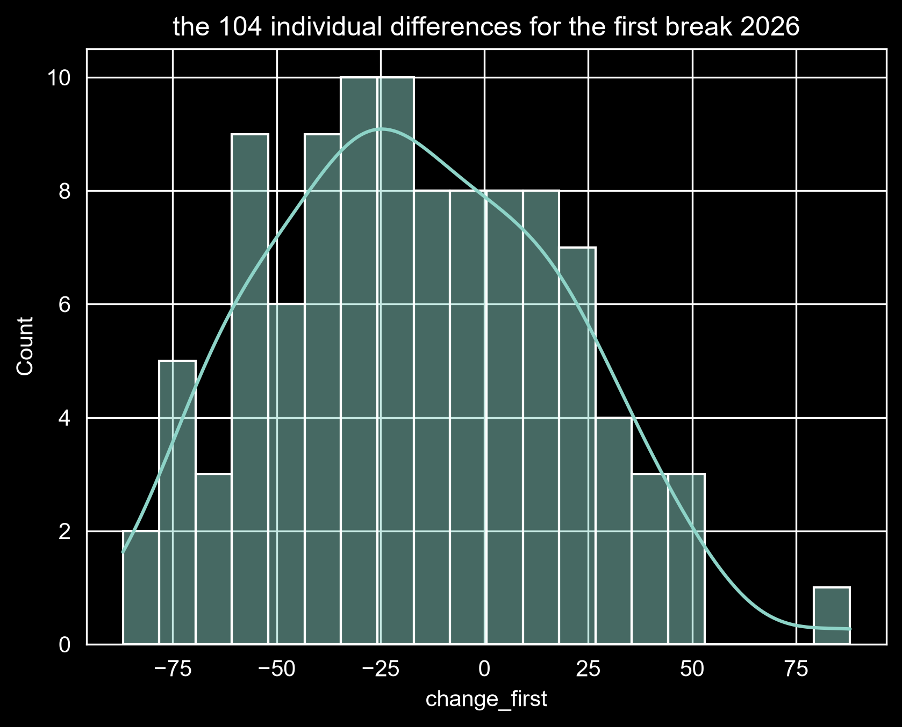
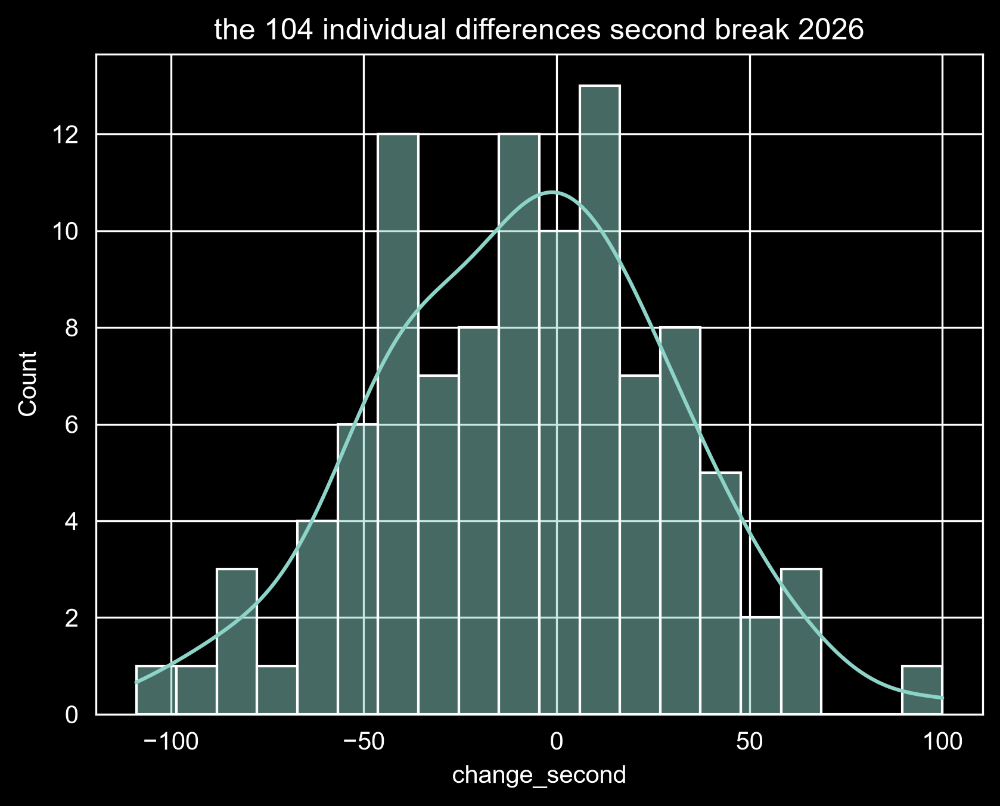
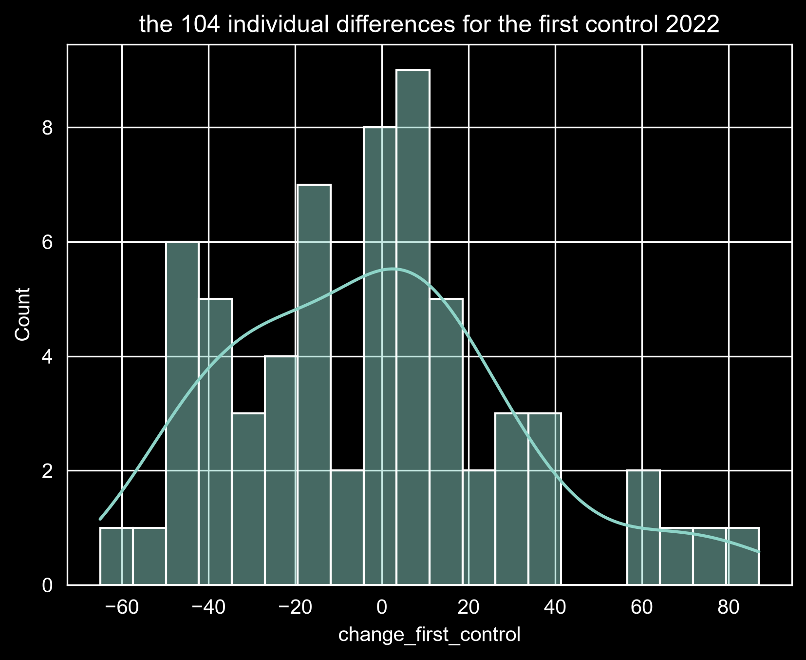
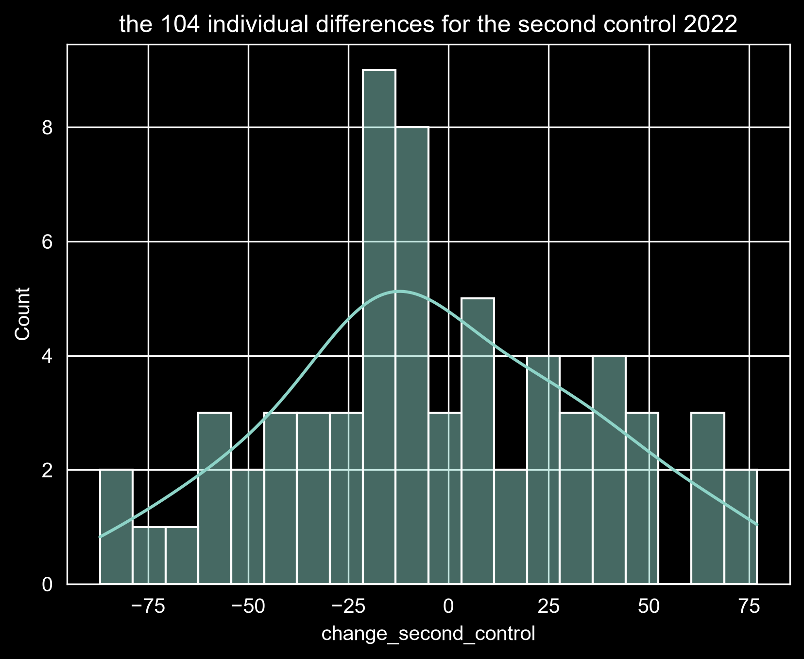

# Do Hydration Breaks Reduce Football Match Intensity?

## Project Overview

This project investigates whether hydration breaks are associated with changes in football match activity.

Rather than assuming that hydration breaks reduce intensity, the analysis compares event activity before and after hydration-break periods in the **2026 FIFA World Cup**, then compares those changes with equivalent periods from the **2022 FIFA World Cup**, where the same hydration-break regime was not present.

The analysis uses football event data and treats **total event activity as a proxy for match intensity**.

The nine event types used throughout the analysis are:

* Passes
* Shots
* Fouls
* Interceptions
* Dribbles
* Clearances
* Ball recoveries
* Dispossessed events
* Tackles

---

# Data Sources

## 2026 FIFA World Cup

The 2026 event data were obtained from the [WhoScored-based WC2026 events dataset](https://github.com/nlbair/wc2026-events).

The dataset contains event-level information for all **104 matches** of the 2026 FIFA World Cup.

## 2022 FIFA World Cup

The 2022 event data were obtained from the [StatsBomb Open Data repository](https://github.com/statsbomb/open-data).

The 2022 FIFA World Cup contains **64 matches** and is used as a no-break comparison period.

> ⚠️ **Important limitation:** The two tournaments come from different event-data providers. Differences in event definitions, recording methodology, and data coverage may therefore affect the cross-year comparison.

---

# Analysis Design

The analysis uses 10-minute event windows around the relevant periods of each tournament.

### 2026 Hydration-Break Periods

| Period       | Before        | After         |
| ------------ | ------------- | ------------- |
| First break  | 12–22 minutes | 25–35 minutes |
| Second break | 57–67 minutes | 70–80 minutes |

The hydration-break intervals themselves are excluded from the comparison.

### 2022 No-Break Control Periods

| Period         | Before        | After         |
| -------------- | ------------- | ------------- |
| First control  | 12–22 minutes | 22–32 minutes |
| Second control | 57–67 minutes | 67–77 minutes |

The 2022 periods provide comparable windows without the 2026 hydration-break intervention.

For every match, the primary change measure is:

**After − Before**

Therefore:

* Negative value → lower event activity in the after-window
* Positive value → higher event activity in the after-window
* Zero → no change

---

# Data Preparation

## `data_cleaning_2022.ipynb`

This notebook transforms the raw 2022 StatsBomb event data into analysis-ready datasets.

The main steps include:

* Extracting event types from the nested StatsBomb event structure.
* Resolving nested `Duel` events into specific subtypes such as tackles.
* Selecting the match, team, event, period, and timing information required for the analysis.
* Converting nested fields such as team, event type, and play pattern into usable values.
* Creating match-time information from the recorded minute and second.
* Selecting the nine common event types used in the final analysis.
* One-hot encoding the event types.
* Creating the four 10-minute comparison windows:

  * `12–22`
  * `22–32`
  * `57–67`
  * `67–77`
* Saving the resulting match-level window datasets.

These datasets provide the **no-break control periods** used in the later analysis.

---

## `data_cleaning_2026.ipynb`

This notebook transforms the raw 2026 WhoScored-based event data into analysis-ready datasets.

The main steps include:

* Selecting the event and match information required for the analysis.
* Converting event categories into indicator variables.
* Removing event types that were not relevant to the intensity analysis.
* Standardizing period information and retaining first- and second-half events.
* Converting match minutes and seconds into a usable match-time variable.
* Standardizing the event categories to the same nine features used for 2022.
* Handling team-name inconsistencies in the source data.
* Creating the four 10-minute windows surrounding the two hydration breaks:

  * `12–22` → before the first break
  * `25–35` → after the first break
  * `57–67` → before the second break
  * `70–80` → after the second break
* Excluding the hydration-break intervals themselves from the comparison windows.
* Saving the resulting match-level window datasets.

The final 2026 cleaning process produced **416 window-specific datasets**, four windows for each of the 104 matches.

---

## `data_merging_2026.ipynb`

This notebook combines the individual match-level CSV files into the final datasets used by the analysis notebooks.

The match-level files for each window were vertically concatenated into one CSV per window.

The resulting datasets are:

### 2022

* `2022_12_22.csv`
* `2022_22_32.csv`
* `2022_57_67.csv`
* `2022_67_77.csv`

### 2026

* `2026_12_22.csv`
* `2026_25_35.csv`
* `2026_57_67.csv`
* `2026_70_80.csv`

These eight merged datasets form the input to the analysis notebooks.

---

# Project Utilities

Reusable helper functions are stored in `syc/utilities.py`. These functions keep the notebooks organized and avoid repeating common operations.

## `time_extractor()`

`time_extractor()` extracts the predefined analysis windows from a cleaned event-level dataset.

The function accepts the cleaned dataset and the World Cup year, then returns four DataFrames corresponding to the analysis windows for that tournament.

### 2026 World Cup

* 12:00–22:00
* 25:00–35:00
* 57:00–67:00
* 70:00–80:00

### 2022 World Cup

* 12:00–22:00
* 22:00–32:00
* 57:00–67:00
* 67:00–77:00

Using the same function for both datasets keeps the time-window extraction consistent while allowing the window definitions to differ according to the tournament.

## `statistics()`

`statistics()` is a reusable descriptive-statistics helper used during the match-level analysis.

It summarizes the distribution of paired changes, including:

* Mean
* Median
* Standard deviation
* Minimum
* Maximum
* 25th percentile (Q1)
* 75th percentile (Q3)
* Interquartile range (IQR)

The function was used consistently across the 2026 break analysis and the 2022 no-break control analysis.

---

# Main Analysis

## `Intensity Chnage Analyis.ipynb`

This notebook performs the main 2026 hydration-break analysis.

The analysis was conducted at the **match level**, with each match providing paired before-and-after observations.

### 1. Data Overview and Quality Checks

The four 2026 datasets were checked for:

* Number of events
* Number of matches
* Number of teams
* Data types
* Missing values
* Expected match coverage
* Whether every match contained both teams

All four windows contained the expected **104 matches**, with two teams represented in each match.

### 2. Event Composition

The total number of each event type was compared across the four windows.

This showed that changes in total activity were not identical across all event categories. Passing activity, for example, decreased after both breaks, while other event types showed mixed patterns.

### 3. Baseline Intensity

Total event activity was calculated for each 10-minute window.

| Window | Total events |
| ------ | -----------: |
| 12–22  |       14,481 |
| 25–35  |       12,733 |
| 57–67  |       12,992 |
| 70–80  |       12,130 |

The aggregate activity therefore decreased by:

* **1,748 events** after the first break
* **862 events** after the second break

However, aggregate totals can hide substantial differences between individual matches, so the analysis then moved to match-level comparisons.

### 4. Individual Event Features

The nine event categories were compared separately.

For the first break, passing activity showed the largest absolute decrease:

**11,573 → 9,870 passes**

Other event types showed mixed changes, including increases in dribbles and tackles.

For the second break, decreases were distributed across several event categories, while some categories, such as fouls, increased slightly.

### 5. First vs Second Hydration Break

The two breaks were analyzed separately because the first and second halves of football matches have different contextual conditions.

The results showed that the two periods did not behave identically.

---

# Match-to-Match Variation

After comparing aggregate event totals, the analysis examined how the change varied from match to match.

For each match:

**Change = After − Before**

### First Hydration-Break Period

* **69 of 104 matches (66.35%)** had lower event activity after the break.
* **34 matches (32.69%)** had higher activity.
* **1 match (0.96%)** showed no change.
* Mean paired change: **−16.81**
* Median paired change: **−19.50**
* Standard deviation: **34.77**
* Range: **−87 to +88**

The distribution was clearly shifted toward negative values, although there was substantial match-to-match variation.

### Second Hydration-Break Period

* **60 of 104 matches (57.69%)** had lower event activity after the break.
* **42 matches (40.38%)** had higher activity.
* **2 matches (1.92%)** showed no change.
* Mean paired change: **−8.29**
* Median paired change: **−6.00**
* Standard deviation: **38.02**
* Range: **−109 to +100**

The second-break distribution was closer to zero and showed greater variability.

### Distribution of Paired Differences

| Statistic          | First break | Second break |
| ------------------ | ----------: | -----------: |
| Mean               |      −16.81 |        −8.29 |
| Median             |      −19.50 |        −6.00 |
| Q1                 |      −39.75 |       −36.00 |
| Q3                 |        9.50 |        14.75 |
| IQR                |       49.25 |        50.75 |
| Standard deviation |       34.77 |        38.02 |
| Minimum            |         −87 |         −109 |
| Maximum            |          88 |          100 |

---

# 2026 Distribution Visualizations

The histograms below show the actual match-level paired differences rather than only the average change.

### First Hydration Break

### Second Hydration Break

These visualizations show that the first-break distribution was more clearly shifted toward negative values, while the second-break distribution was closer to zero and more variable.

---

# Statistical Analysis of 2026

Because the before- and after-break measurements came from the **same matches**, paired statistical testing was used.

Two-sided **Wilcoxon signed-rank tests** were performed separately for the two hydration breaks.

A two-sided test was used because the analysis did not assume beforehand that hydration breaks would decrease activity.

| Comparison   | Wilcoxon W | p-value | Effect size |
| ------------ | ---------: | ------: | ----------: |
| First break  |     1317.0 | < 0.001 |   r ≈ 0.439 |
| Second break |     2003.0 |  0.0374 |   r ≈ 0.204 |

Because two break-period tests were performed, a **Bonferroni-adjusted significance level of 0.025** was also considered.

* The first-break result remained statistically significant.
* The second-break result did not remain statistically significant after correction.

---

# 2022 No-Break Control Analysis

## `control_comparison_2022.ipynb`

This notebook introduces the **2022 FIFA World Cup as a no-break control**.

The purpose is to determine whether similar changes occurred during comparable periods without the 2026 hydration-break regime.

The 2022 analysis followed the same general match-level analytical structure used for the 2026 data before making the final cross-year comparison.

| Period        | 2026          | 2022 Control  |
| ------------- | ------------- | ------------- |
| First period  | 12–22 → 25–35 | 12–22 → 22–32 |
| Second period | 57–67 → 70–80 | 57–67 → 67–77 |

---

## 2022 First Control Period

* **33 of 64 matches** had lower event activity.
* **31 matches** had higher activity.
* Mean paired change: **−2.41**
* Median: **−1.00**
* Standard deviation: **33.27**
* Range: **−65 to +87**
### 2022 First No-Break Control



Wilcoxon signed-rank test:

* **W = 906.5**
* **p = 0.372**
* Effect size: **r ≈ 0.112**

There was no statistically significant evidence of a systematic change between the two periods.

---

## 2022 Second Control Period

* **36 of 64 matches** had lower event activity.
* **28 matches** had higher activity.
* Mean paired change: **−3.67**
* Median: **−10.00**
* Standard deviation: **39.05**
* Range: **−87 to +77**
### 2022 Second No-Break Control



Wilcoxon signed-rank test:

* **W = 924.5**
* **p = 0.440**
* Effect size: **r ≈ 0.097**

Again, there was no statistically significant evidence of a systematic change.

Together, the four histograms show substantial match-to-match variation. The 2026 first-break distribution is more clearly shifted toward negative values, while the 2022 control distributions show more balanced increases and decreases.

---

# Final 2026 vs 2022 Comparison

The final stage examines whether the distributions of match-level changes in 2026 differed from the corresponding no-break distributions in 2022.

Because the 2026 and 2022 matches are **different sets of matches**, the observations are independent for this comparison. Therefore, the **Mann–Whitney U test** was used instead of the paired Wilcoxon signed-rank test.

## First Period

|               |   2026 |  2022 |
| ------------- | -----: | ----: |
| Mean change   | −16.81 | −2.41 |
| Median change | −19.50 | −1.00 |

Mann–Whitney U test:

* **U = 4072.5**
* **p = 0.0151**
* Rank-biserial correlation: **rᵣᵦ ≈ −0.224**

The difference between the two distributions remained statistically significant after the Bonferroni-adjusted threshold of **α = 0.025**.

Descriptively, the 2026 distribution was shifted toward more negative changes than the corresponding 2022 control distribution.

## Second Period

|               |  2026 |   2022 |
| ------------- | ----: | -----: |
| Mean change   | −8.29 |  −3.67 |
| Median change | −6.00 | −10.00 |

Mann–Whitney U test:

* **U = 3503.0**
* **p = 0.5687**
* Rank-biserial correlation: **rᵣᵦ ≈ −0.052**

There was no statistically significant difference between the 2026 second-break changes and the corresponding 2022 no-break control.

The very small rank-biserial effect size also indicates little separation between the two distributions.

---

# Key Findings

The analysis produced a **mixed result rather than a simple conclusion that hydration breaks always reduce football match intensity**.

### First Hydration-Break Period

The first hydration-break period showed the clearest difference:

* Activity decreased in **66.35%** of 2026 matches.
* The within-match change was statistically significant.
* The effect size was **r ≈ 0.439**.
* The distribution of 2026 match-level changes was significantly different from the corresponding 2022 no-break control.
* The cross-year comparison produced **p = 0.0151** and **rᵣᵦ ≈ −0.224**.

### Second Hydration-Break Period

The evidence for the second break was weaker:

* Activity decreased in **57.69%** of 2026 matches.
* The mean change was **−8.29 events**.
* The within-match Wilcoxon test produced **p = 0.0374**, but this did not remain significant after the Bonferroni-adjusted threshold of **0.025**.
* The 2026 distribution was not significantly different from the corresponding 2022 no-break control.
* The final cross-year effect size was very small (**rᵣᵦ ≈ −0.052**).

### Overall Conclusion

The results are **consistent with an association between the first 2026 hydration-break period and a reduction in event activity**, particularly relative to the corresponding 2022 no-break period.

However, the same pattern was not observed consistently for the second break.

Therefore, the analysis does **not** provide evidence that hydration breaks consistently reduce football match intensity across both break periods.

The findings instead suggest that the relationship between hydration breaks and match activity may depend on the point of the match and the surrounding match circumstances.

---

# Limitations

Several limitations should be considered when interpreting the results:

* The 2026 data came from **WhoScored**, while the 2022 control data came from **StatsBomb**. Differences in event definitions, recording methodology, and data coverage may affect the cross-year comparison.
* The 2022 and 2026 matches are different sets of matches, so the comparison cannot control for every difference in teams, tactics, opponents, or match circumstances.
* Football intensity is multidimensional. Total event count is a useful proxy for activity but does not capture every aspect of physical or tactical intensity.
* Match state, scoreline, substitutions, tactical changes, fatigue, and normal changes in game dynamics can influence event activity.
* Teams appear in multiple matches, so match-level observations are not perfectly independent in a broader statistical sense.
* The observational before/after design does not establish that hydration breaks **caused** the observed changes.

The strongest conclusion supported by this analysis is therefore that **the first 2026 hydration-break period was associated with a greater reduction in event activity than the corresponding no-break control period, while the same pattern was not observed for the second break.**

---

# Repository Structure

```text
hydration-break-analysis/
│
├── data/
│   ├── 2022_cleaned/
│   │   ├── 2022_12_22.csv
│   │   ├── 2022_22_32.csv
│   │   ├── 2022_57_67.csv
│   │   └── 2022_67_77.csv
│   │
│   └── 2026_cleaned/
│       ├── 2026_12_22.csv
│       ├── 2026_25_35.csv
│       ├── 2026_57_67.csv
│       └── 2026_70_80.csv
│
├── images/
│   ├── histogram_first_break.png
│   ├── histogram_second_break.png
│   ├── histogram_first_control.png
│   └── histogram_second_control.png
│
├── syc/
│   └── utilities.py
│
├── notebooks/
│   ├── data_cleaning_2022.ipynb
│   ├── data_cleaning_2026.ipynb
│   ├── data_merging_2026.ipynb
│   ├── Intensity Chnage Analyis.ipynb
│   └── control_comparison_2022.ipynb
│
└── README.md
```

---

# Notebooks Summary

| Notebook                         | Purpose                                                    |
| -------------------------------- | ---------------------------------------------------------- |
| `data_cleaning_2022.ipynb`       | Clean and transform raw StatsBomb 2022 event data          |
| `data_cleaning_2026.ipynb`       | Clean and transform raw WhoScored 2026 event data          |
| `data_merging_2026.ipynb`        | Merge match-level window datasets into final analysis CSVs |
| `Intensity Chnage Analyis.ipynb` | Analyze event activity around the 2026 hydration breaks    |
| `control_comparison_2022.ipynb`  | Analyze the 2022 no-break control and compare it with 2026 |

---

# Visualizations

The repository includes four histograms showing the match-level paired differences used throughout the analysis:

1. **2026 First Hydration Break**
2. **2026 Second Hydration Break**
3. **2022 First Control Period**
4. **2022 Second Control Period**

These visualizations complement the descriptive statistics and statistical tests by showing the actual spread and direction of match-to-match changes rather than relying only on aggregate totals or averages.

All four images are stored in the repository's `images/` directory and are embedded directly in this README.
